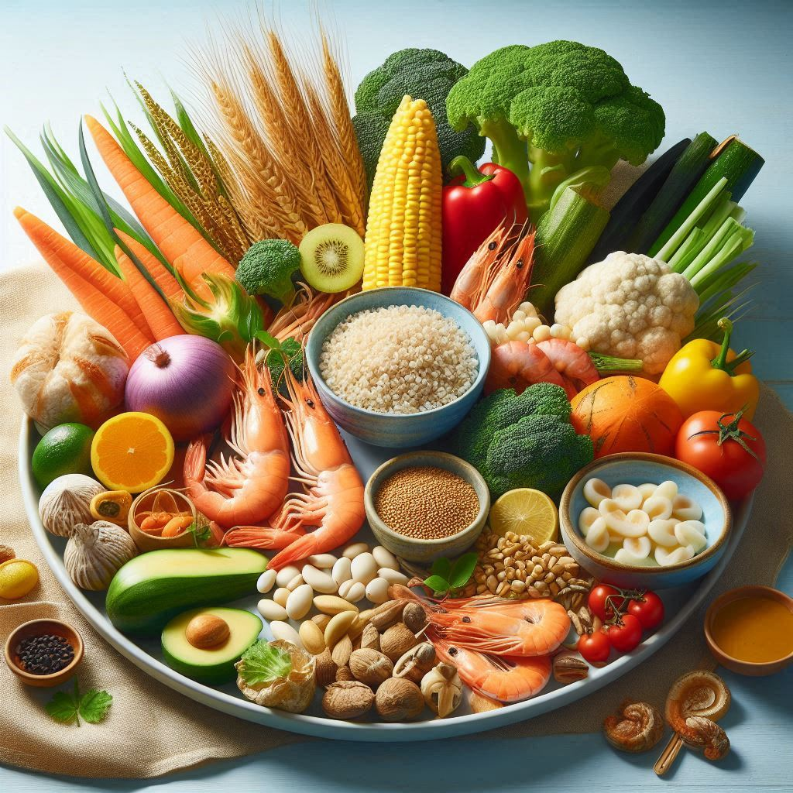

# 薩摩ふうど｜SATSUMA FOOD



**地域の恵み × 健康志向。鹿児島発・無添加＆グルテンフリー。**

鹿児島の風土が育んだ県産素材を使用した、無添加・グルテンフリー食品のブランドサイトです。

🌐 **デモサイト**: [https://satumafoodkanri-debug.github.io/satsuma-food-site/](https://satumafoodkanri-debug.github.io/satsuma-food-site/)

---

## 🎯 プロジェクト概要

「薩摩ふうど」は、鹿児島県産の素材にこだわり、無添加・グルテンフリーで作られた食品ブランドです。このサイトでは：

- **ブランドストーリー**: 鹿児島の恵みと健康志向を融合したコンセプト
- **こだわり**: 県産素材、無添加、グルテンフリーへの取り組み
- **商品紹介**: 米粉を使った商品ラインナップ

---

## ✨ 主な機能

### 🎬 スクロール連動スライダー
- スクロールに応じて背景とスライドが同期
- GSAPとSwiperを使用した滑らかなアニメーション
- 画像の視差効果（パララックス）

### 📱 レスポンシブデザイン
- デスクトップ、タブレット、モバイルに対応
- 可変グリッドレイアウト
- タッチデバイス最適化

### 🎨 モダンなUI/UX
- グラスモーフィズム（ガラス風）のヘッダー
- フェードインアニメーション
- カスタムフォント「ShigotoMemogaki」使用

---

## 🛠️ 技術スタック

| カテゴリ | 技術 |
|---------|------|
| **HTML** | HTML5 (セマンティック) |
| **CSS** | CSS3 (カスタムプロパティ、Grid、Flexbox) |
| **JavaScript** | ES6+ |
| **ライブラリ** | GSAP 3.12.5, ScrollTrigger, Swiper 11 |
| **フォント** | ShigotoMemogaki (カスタム) |
| **ホスティング** | GitHub Pages |

---

## 📁 ファイル構成

```
satsuma-food-site/
├── index.html          # メインHTMLファイル
├── style.css           # スタイルシート
├── script.js           # JavaScript
├── Designer.jpeg       # ブランド画像・ファビコン
├── shigoto3/           # フォントフォルダ
│   └── ShigotoMemogaki-Regular-1-02.ttf
├── .nojekyll          # GitHub Pages設定
└── README.md          # このファイル
```

---

## 🚀 セットアップ方法

### ローカル環境で実行

1. **リポジトリをクローン**
```bash
git clone https://github.com/satumafoodkanri-debug/satsuma-food-site.git
cd satsuma-food-site
```

2. **ブラウザで開く**
```bash
# macOS
open index.html

# Windows
start index.html

# Linux
xdg-open index.html
```

または、ローカルサーバーを起動（推奨）：

```bash
# Python 3の場合
python -m http.server 8000

# Node.jsの場合（http-serverインストール済み）
npx http-server
```

ブラウザで `http://localhost:8000` を開く

---

## 🎨 カスタマイズ

### ブランドカラーの変更

`style.css` の `:root` 内のCSS変数を編集：

```css
:root {
  --brand: #A38F24;   /* メインカラー */
  --ink: #000;        /* テキスト色 */
  --muted: #6b7280;   /* サブテキスト色 */
  --line: #ece7df;    /* 線の色 */
  --bg: #fbf8f2;      /* 背景色 */
}
```

### スライドの追加

`index.html` の `.swiper-wrapper` 内に新しいスライドを追加：

```html
<div class="swiper-slide"
     data-bg='{"type":"image","url":"画像URL","overlay":0.25}'>
  <div class="slide-inner">
    <div>
      <h2 class="slide-title">タイトル</h2>
      <p class="slide-lead">説明文</p>
    </div>
    <div class="kv-img">
      
    </div>
  </div>
</div>
```

---

## 📊 パフォーマンス最適化

- **preconnect**: CDNへの早期接続
- **font preload**: カスタムフォントの優先読み込み
- **画像最適化**: Unsplash APIでサイズ指定 (`w=1600&q=70`)
- **遅延読み込み**: スクロールトリガーによる段階的表示

---

## 🌐 デプロイ

GitHub Pagesへのデプロイは自動的に行われます。

### 手動デプロイ手順

1. リポジトリの **Settings** → **Pages**
2. **Source** を `main` ブランチに設定
3. 数分後に公開URLが表示されます

---

## 📄 ライセンス

このプロジェクトは薩摩ふうど。

---

## 👤 開発者

**薩摩ふうど管理**  
GitHub: [@satumafoodkanri-debug](https://github.com/satumafoodkanri-debug)

---

## 🙏 使用素材・ライブラリ

- [GSAP](https://greensock.com/gsap/) - アニメーションライブラリ
- [Swiper](https://swiperjs.com/) - スライダーライブラリ
- [Unsplash](https://unsplash.com/) - フリー画像素材
- ShigotoMemogaki - カスタムフォント

---

## 📝 更新履歴

### v1.0.0 (2025-10-01)
- 初回リリース
- スクロール連動スライダー実装
- レスポンシブ対応
- 商品紹介セクション追加

---

**Made with in Kagoshima, Japan**